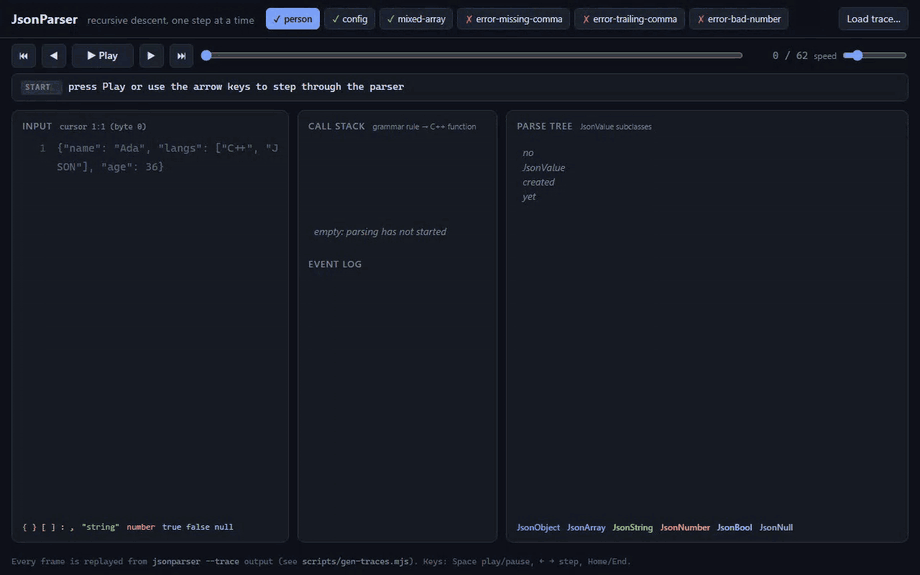
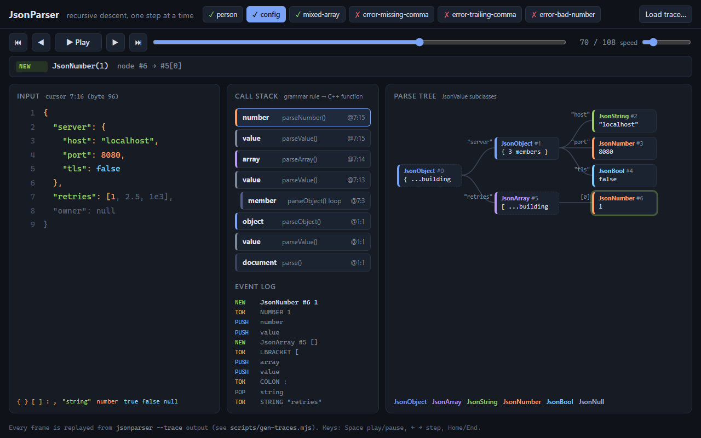
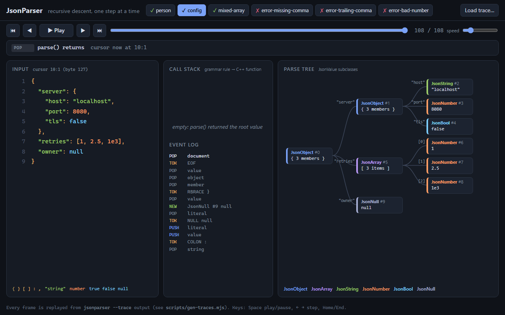
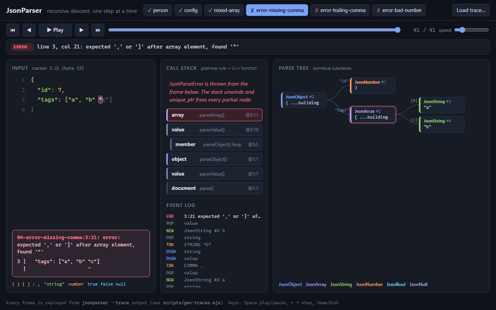
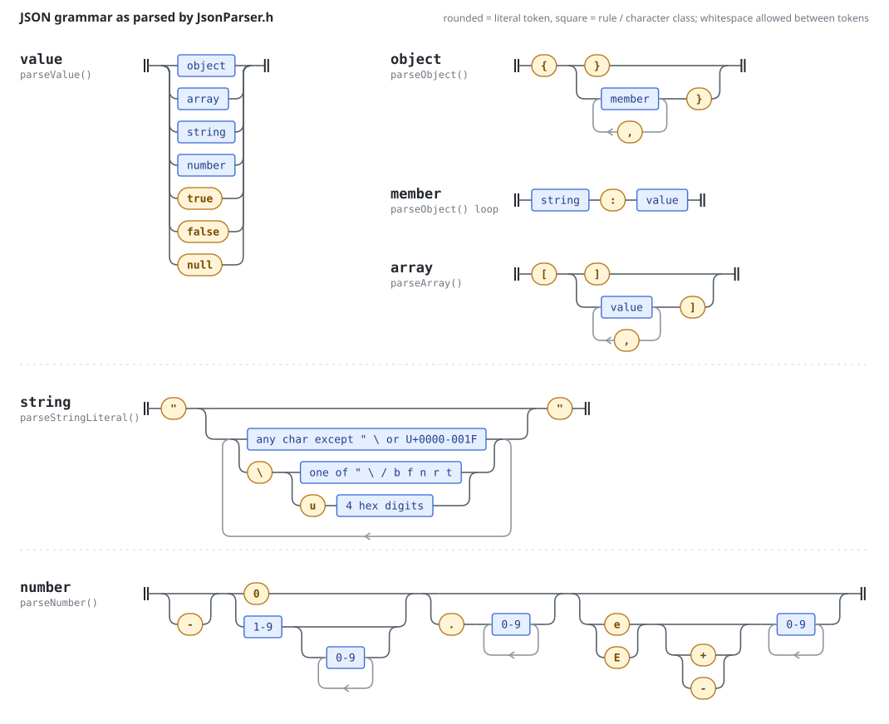
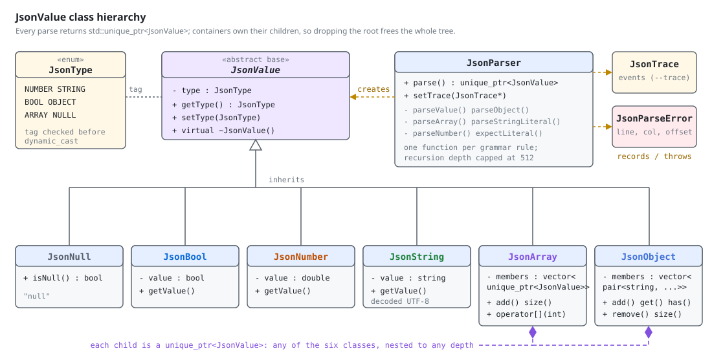
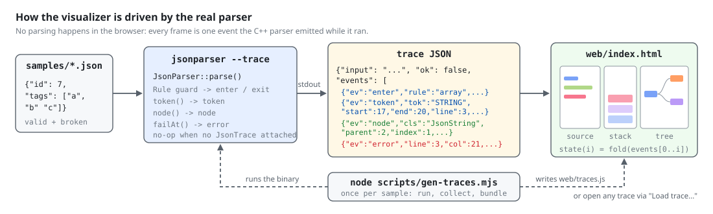

# JsonParser

**Live demo:** https://jsonparser-pink.vercel.app

A small recursive-descent JSON parser in C++17 that builds a tree of `JsonValue` subclasses, reports errors as `line:col`, and can record every step it takes so a web page can replay the parse.



The GIF is a recording of `web/index.html` replaying traces produced by the real binary (`jsonparser --trace`). There is also an [MP4 version](docs/media/demo.mp4).

## What it does

- Parses RFC 8259 JSON into `JsonObject`, `JsonArray`, `JsonString`, `JsonNumber`, `JsonBool` and `JsonNull` nodes held by `std::unique_ptr<JsonValue>`.
- Rejects invalid input with a `JsonParseError` that names the position and the problem:

  ```
  $ jsonparser samples/04-error-missing-comma.json
  samples/04-error-missing-comma.json:3:21: error: expected ',' or ']' after array element, found '"'
  ```

- Handles the parts of the spec that small parsers usually skip: `\uXXXX` escapes including surrogate pairs (decoded to UTF-8), exponents, the no-leading-zeros rule, control characters inside strings, trailing garbage, and a nesting limit of 512.
- `--trace` prints a JSON log of the parse: every token, every grammar rule entered and left, every node created, and the error if there is one. The visualizer in `web/` animates that log.

| Screen | |
|---|---|
|  |  |
|  | Left: source with the current token boxed and consumed text colored by token type. Middle: the recursive-descent call stack (grammar rule and the C++ function that implements it). Right: the `JsonValue` tree as it is allocated. Dashed nodes are containers still being filled. |

## How it works

### Grammar

Each rule in the diagram is one function in `JsonParser.h`. `parseValue()` looks at one character and dispatches; objects and arrays loop over their members and recurse back into `parseValue()`.



The parser never builds a separate token list. It works on the string with a single cursor (`pos`), skipping whitespace before each token. Errors are raised at the exact byte where the grammar stops matching, and converted to a 1-based line and column (columns count UTF-8 characters, not bytes).

### Class hierarchy



`JsonValue` stores a `JsonType` tag, so callers can check the type before `dynamic_cast`ing to the concrete class. Containers own their children through `unique_ptr`, so dropping the root frees the whole tree, and a parse that throws halfway through leaks nothing.

### Trace and visualizer



Tracing is optional: `JsonParser::setTrace(&trace)` attaches a `JsonTrace`, and without one every hook returns immediately. Four hooks produce the events:

| Event | Emitted by | Fields |
|---|---|---|
| `enter` / `exit` | RAII `Rule` guard at the top of each parse function | `rule`, `pos` |
| `token` | after a token is consumed | `tok`, `text`, `start`, `end`, `line`, `col` |
| `node` | when a `JsonValue` subclass is allocated | `id`, `cls`, `parent`, `key` or `index`, `preview` |
| `error` | `failAt()`, just before throwing | `pos`, `line`, `col`, `message` |

When an exception unwinds, the `Rule` guards do not emit `exit`, so the last state in the trace still shows the full call stack at the point of failure. The page rebuilds its state for step *i* by folding events `0..i`. Stepping backwards is exact, and the page has no parser of its own.

## Quick start

Requirements: a C++17 compiler and CMake 3.16+. Node.js is only needed to regenerate the traces.

```sh
cmake -S . -B build
cmake --build build --config Release
ctest --test-dir build -C Release --output-on-failure
```

That uses your default CMake generator: Visual Studio/MSVC on Windows, Makefiles elsewhere. For MinGW with Ninja add `-G Ninja`. Without CMake, the whole program is a single translation unit:

```sh
g++ -std=c++17 -O2 main.cpp -o jsonparser
g++ -std=c++17 -O2 tests/run_tests.cpp -o json_tests && ./json_tests tests/conformance
```

Run it (the binary is `build/jsonparser`, or `build/Release/jsonparser.exe` with Visual Studio):

```sh
jsonparser samples/02-config.json                 # pretty-print; exit 0
jsonparser samples/05-error-trailing-comma.json   # error at 1:43; exit 1
echo '[1, 2' | jsonparser -                       # read stdin
jsonparser --trace samples/01-person.json > trace.json
jsonparser --demo                                 # the original example suite
```

Open the visualizer by opening `web/index.html` in a browser. It works from `file://` because the traces are bundled in `web/traces.js`. To see your own input, run `--trace` on it and use **Load trace...**, or drop the file in `samples/` and rebuild the bundle:

```sh
node scripts/gen-traces.mjs              # runs build/jsonparser on samples/*.json
```

Keys: Space plays or pauses, the arrow keys step, Home and End jump.

The Visual Studio project (`JsonParser.slnx` / `JsonParser.vcxproj`) still builds `main.cpp` as before.

## Tests

`tests/run_tests.cpp` runs three groups (105 checks):

- **Conformance**: 74 files in `tests/conformance/`, named in the JSONTestSuite style. `y_*.json` must parse and `n_*.json` must be rejected. They cover empty input, trailing and missing commas, unquoted and single-quoted keys, leading zeros, `1.`, `1e+`, `NaN`, hex, invalid escapes, short `\u` escapes, lone surrogates, raw control characters in strings, trailing garbage, comments, form feed used as whitespace, and nesting depths of 100 (accepted) and 600 (rejected).
- **Error positions**: 19 inputs with the expected line, column and message fragment, including multi-line input and a column after a two-byte UTF-8 character.
- **Values**: key order, number precision, duplicate keys, escape decoding, and whether the trace's enter/exit events balance.

## Project layout

```
JsonValue.h              base class + JsonType tag
JsonNumber.h ...         one header per JSON type (the matching .cpp files are empty, kept for the VS project)
JsonParser.h             the parser, JsonParseError, JsonTrace (header-only)
main.cpp                 CLI: pretty-print, --trace, --demo
tests/run_tests.cpp      test runner
tests/conformance/       y_/n_ test files
samples/                 inputs shown in the visualizer
scripts/gen-traces.mjs   runs the binary on samples/ and writes web/traces.js
scripts/gen-railroad.py  regenerates docs/media/grammar-railroad.svg
web/                     index.html, app.js, style.css, traces.js (no build step)
docs/media/              demo recording, screenshots, diagrams
```

## Design notes and trade-offs

- **Header-only, one pass, no token list.** The lexer is folded into the parser. That keeps the code short and makes positions exact, but it means lookahead is limited to the character under the cursor. JSON's grammar never needs more than that.
- **Exceptions for errors.** The first error aborts the parse. There is no recovery or multi-error reporting, because a JSON document with an error is not worth partially using. `unique_ptr` ownership makes the abort leak-free.
- **Objects keep insertion order** in a `vector<pair<string, unique_ptr<JsonValue>>>`. Lookup is linear, which is fine at config-file sizes and gives stable printing. A duplicate key replaces the earlier value.
- **Numbers are `double`** (they were `float`, which lost precision past about 7 digits). Values out of `double` range become `inf` rather than an error. That behavior is implementation-defined in RFC 8259.
- **UTF-8 is passed through, not validated.** Escapes are decoded and lone surrogates rejected, but raw invalid UTF-8 bytes inside strings are accepted as-is.
- **Tracing is opt-in and costs one pointer check per hook** when it is off. The trace is built as a list of pre-serialized JSON strings, so no JSON writer is needed.

## Changes in this revision

The original parser accepted a lot of invalid JSON and returned `nullptr` without saying why. Fixes made along the way:

- `[1 2]`, `[1,]`, `{"a" 1}`, `{"a":1,}`, `{a:1}`, unterminated strings and containers, and trailing garbage were accepted or read past the end of the buffer. They are now errors with positions.
- Numbers used `std::stod` on an unchecked `[-0-9.]*` slice, so `-`, `1.2.3` or `01` either threw `std::invalid_argument` or were accepted. Numbers now follow the grammar exactly, including exponents.
- `\b \f \r \/ \uXXXX` escapes were missing, and unknown escapes were silently kept.
- `isspace` accepted form feed and vertical tab as whitespace.
- Numbers were stored as `float`. Objects lost key order (they used `unordered_map`).
- The printer did not escape strings.

## License

Educational and personal use.
